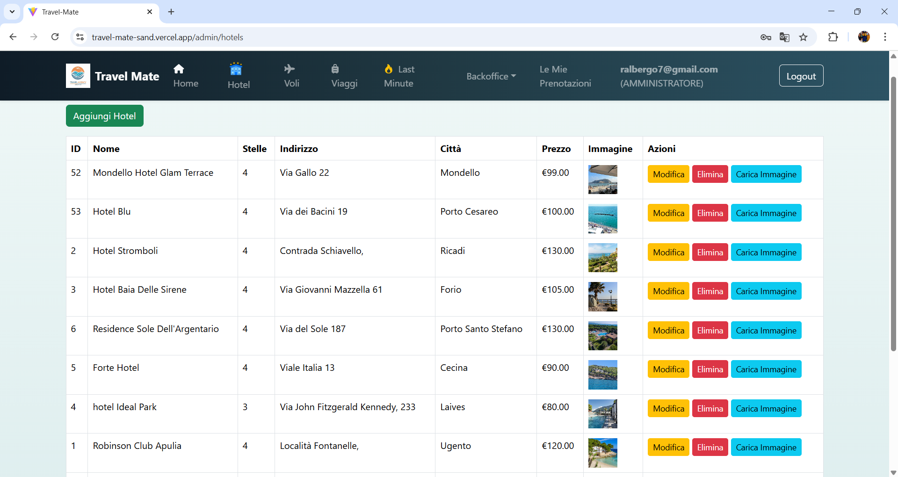

✈️ Travel Mate — Il tuo compagno di viaggio ideale 🌍🧳
Travel Mate è un'applicazione full-stack per la prenotazione di hotel, viaggi, crociere e voli, progettata per offrire un'esperienza semplice, elegante e sicura.
Con un pannello admin back-office, gestione delle recensioni,prenotazioni,utenti, autenticazione JWT e notifiche via email, Travel Mate è pensata per tutti: viaggiatori e amministratori!

💫 Cosa puoi fare con Travel Mate
👤 Utente registrato può:

Prenotare hotel, viaggi e voli

Scrivere e leggere recensioni

Vedere lo storico delle proprie prenotazioni

🛠️ Amministratore può:

Gestire hotel, viaggi e voli

Caricare più immagini via Cloudinary

Modificare e cancellare prenotazioni/recensioni

Inviare automaticamente un’email di conferma quando una prenotazione viene aggiornata da "IN ATTESA" a "CONFERMATA"

🌐 Versione online
🔗 Frontend: https://travel-mate-sand.vercel.app

🔗 Backend: https://travel-mate-backend-production-b35c.up.railway.app

🛠️ vercel.json incluso per supportare il routing client-side SPA (React Router).
Esempio: accedendo direttamente a /viaggi/123 il routing viene gestito correttamente senza 404.

🧪 Tecnologie utilizzate
🖥️ Frontend
React

Vite

Bootstrap 5

Axios

React Router DOM

🔧 Backend
Spring Boot

PostgreSQL

Spring Security + JWT

Cloudinary API

Java Mail Sender (Gmail)

Google Maps Api Key
Google Maps Geocoding

🧪 Testing
JUnit (backend)

Postman per test endpoint

📁 Struttura del progetto
🔗 Frontend Repository: [Travel-mate](https://github.com/Robby75-11/Travel-mate) (verrà caricato su piattaforma Epicode)
🔗 Backend Repository: [Travel-mate-backend](https://github.com/Robby75-11/Travel-mate-backend)

▶️ Avvio del progetto in locale
📦 Frontend (React + Vite)
bash
Copia
Modifica
cd Travel-mate
npm install
npm run dev

🧠 Backend (Spring Boot)
Apri il progetto in IntelliJ

Avvia il file TravelMateApplication.java

Il backend sarà disponibile su http://localhost:8080

📸 Screenshot e GIF (opzionali)
immagini delle principali sezioni: homepage, booking, admin panel, ecc.

🏁 Progetto finale Epicode 2025 — Roberto Albergo
Questo progetto è il risultato del mio percorso formativo full-stack su Epicode:
🔹 Con passione ho integrato backend, frontend e API reali per offrire un’esperienza completa e fluida.
🔹 Travel Mate non è solo un’app: è la mia visione di un modo più semplice e bello di viaggiare.
